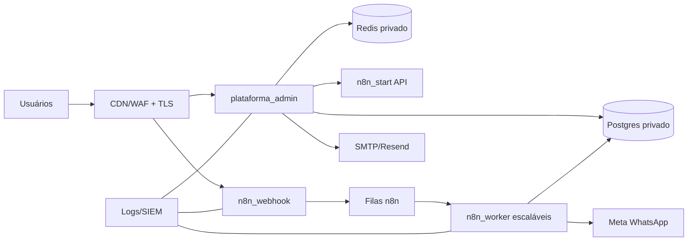

# Avaliação de Segurança da Informação - Agente Político

Versão avaliada: V19.1.1  
Data: 2026-07-08

## Sumário executivo

O projeto já possui uma base relevante de segurança: autenticação própria, sessões em banco com token hash, cookie `httpOnly`, `secure` e `sameSite`, perfis por função, segregação por candidato, trilha de governança, recuperação de senha por token temporário e auditoria de operações críticas. Para operar nacionalmente, porém, ainda precisa evoluir em quatro frentes: perímetro HTTPS e headers, gestão de segredos, observabilidade/auditoria em escala e endurecimento de banco/n8n/containers.

A correção V19.1.1 já adicionou:

- redirecionamento opcional de HTTP para HTTPS por `APP_FORCE_HTTPS=true`;
- headers básicos de segurança no Next.js;
- remoção de segredos como `ARG`/`ENV` de build no Dockerfile;
- execução do container como usuário não-root;
- `APP_PUBLIC_BASE_URL` para links públicos confiáveis, inclusive recuperação de senha.

## Por que a URL aparece sem HTTPS

Há três cenários diferentes:

1. Acesso pelo domínio público do serviço, por exemplo `https://n8n-plataforma-admin...easypanel.host`: deve aparecer com HTTPS.
2. Acesso direto por IP e porta, por exemplo `http://212.85.11.155:3000`: normalmente não terá TLS, pois está acessando o container ou painel sem passar pelo proxy HTTPS.
3. Comunicação interna entre proxy Easypanel e container: pode ocorrer em HTTP dentro da rede privada, desde que a borda pública seja HTTPS e os serviços internos não fiquem expostos à internet.

Recomendação: usuários finais nunca devem usar IP:porta. Devem acessar somente o domínio HTTPS. Ativar `APP_FORCE_HTTPS=true` no ambiente de produção e configurar `APP_PUBLIC_BASE_URL` com o domínio oficial.

## Achados principais

| Prioridade | Achado | Risco | Situação / ação |
|---|---|---|---|
| Alta | Segredos no Dockerfile por `ARG` de build | Token e senha podem ficar gravados na imagem ou histórico de build | Corrigido em V19.1.1. Segredos devem ser apenas variáveis de runtime no Easypanel |
| Alta | Tokens da Meta por candidato armazenados em texto no banco | Acesso indevido ao banco expõe credenciais de WhatsApp | Migrar para cofre de segredos ou criptografia de aplicação com chave fora do banco |
| Alta | n8n com SQL interpolado em snapshots/workflows | Risco de SQL injection e corrupção se dados externos chegarem sem sanitização robusta | Trocar por parâmetros do nó Postgres, stored procedures ou API backend validada |
| Alta | Sem MFA para administrador e gestor | Comprometimento de senha dá acesso amplo | Implementar MFA/TOTP para administrador e gestor |
| Alta | Sem rate limit de login, recuperação e webhooks públicos | Risco de força bruta, abuso e negação de serviço lógica | Adicionar rate limit por IP/usuário/rota e bloqueio progressivo |
| Média | Banco sem configuração explícita de SSL no app | Em rede distribuída, credenciais/dados podem trafegar sem criptografia | Usar SSL se Postgres não estiver na mesma rede privada confiável |
| Média | Healthcheck público revela versão | Facilita fingerprinting | Manter endpoint simples ou proteger versão detalhada em rota administrativa |
| Média | CSP ainda não ativado | Reduz proteção contra XSS em caso de falha futura | Planejar CSP gradativa em modo report-only antes de bloquear |
| Média | Sem inventário formal de dados e retenção | Risco LGPD em escala nacional | Criar política de retenção, descarte e resposta a titulares |
| Média | Backups e restauração não estão validados por rotina automatizada | Backup sem teste pode falhar em incidente real | Definir RPO/RTO e executar teste mensal de restore |

## Controles já existentes no projeto

- RBAC por perfis: administrador, gestor de campanha, operador e analista.
- Segregação de acesso por candidato para perfis não administradores.
- Senhas com `scrypt` e salt.
- Sessões em tabela própria, com token hash e expiração de 8 horas.
- Cookies `httpOnly`, `secure` e `sameSite=lax`.
- Logout com invalidação da sessão.
- Recuperação de senha por token hash, expiração de 1 hora e revogação de sessões antigas.
- Auditoria via governança para login, logout, cadastro, troca de senha, remessas e workflows.
- Server Actions e consultas SQL parametrizadas no backend principal em boa parte do código.

## Requisitos mínimos para produção nacional

### 1. Perímetro e HTTPS

- Domínio oficial para a plataforma administrativa.
- TLS válido com renovação automática.
- `APP_FORCE_HTTPS=true`.
- `APP_PUBLIC_BASE_URL=https://dominio-oficial`.
- HSTS ativo somente depois de validar que todos os subdomínios funcionam por HTTPS.
- Bloqueio de acesso direto por IP:porta em firewall/security group.
- WAF/CDN com proteção DDoS e rate limit nas rotas públicas.

### 2. Identidade e acesso

- MFA obrigatório para administrador e gestor de campanha.
- Política de senha mínima: 12 caracteres para administradores e gestores; 8 ou 10 para demais perfis.
- Bloqueio progressivo por tentativas de login.
- Revisão mensal de usuários ativos.
- Proibição de conta compartilhada.
- Registro de IP, user-agent e horário em eventos de login.
- Sessões administrativas com tempo reduzido e revogação centralizada.

### 3. Banco de dados

- Postgres em rede privada, sem porta pública.
- Usuário de aplicação sem privilégios de superusuário.
- Usuário separado para n8n, com permissões mínimas.
- SSL obrigatório se houver tráfego fora da rede privada local.
- Backup automático diário, retenção mínima e teste periódico de restore.
- Criptografia em repouso no volume/disco.
- Separação futura por schemas ou RLS se a base nacional crescer muito.

### 4. n8n, webhooks e automações

- Webhooks públicos devem ter autenticação por token, assinatura HMAC ou segredo no path.
- Workflows não devem montar SQL com interpolação de texto vindo do eleitor/usuário.
- Separar workers por fila/função para reduzir blast radius.
- Registrar execução, payload mínimo, candidato, status e erro técnico.
- Aplicar rate limit em webhooks de entrada e cadência.
- Não armazenar tokens de Meta, SMTP ou n8n dentro de nós exportados para Git.

### 5. Containers e Easypanel

- Segredos somente em variáveis de ambiente de runtime.
- Container sem root, já ajustado em V19.1.1.
- Healthcheck HTTP interno para reinício automático.
- Limites de CPU/memória por serviço.
- Logs centralizados e retenção definida.
- Deploy com imagem versionada e rollback documentado.
- Atualização periódica da base image Node.
- Separar `plataforma_admin`, `n8n_start`, `n8n_webhook`, `n8n_worker`, Postgres e Redis em serviços com menor privilégio.

### 6. Observabilidade e controle de uso

Para saber quem está utilizando a plataforma, é necessário evoluir a auditoria para um painel operacional com:

- usuários online ou sessão ativa;
- último login por usuário;
- IP e user-agent do login;
- ações administrativas críticas;
- criação, alteração e exclusão de usuários;
- exportações de dados;
- remessas de e-mail e WhatsApp;
- execuções de workflows;
- erros por rota e por serviço;
- consumo de CPU, memória, I/O, filas do n8n, Redis e conexões do Postgres.

Recomendação: criar uma página `Segurança e Auditoria` para administrador com filtro por usuário, candidato, evento, IP, período e tipo de ação.

### 7. LGPD e resposta a incidentes

A plataforma trata dados pessoais e, em campanha política, pode tocar dados sensíveis por inferência de opinião política, preferências e relacionamento com candidato. O programa nacional deve ter:

- inventário de dados tratados;
- base legal por finalidade;
- política de retenção e descarte;
- processo de atendimento ao titular;
- registro de consentimento ou legítimo interesse quando aplicável;
- DPO/encarregado definido;
- plano de resposta a incidentes;
- procedimento de comunicação à ANPD e aos titulares quando houver risco ou dano relevante.

A ANPD orienta que incidentes com risco ou dano relevante sejam avaliados e, quando cabível, comunicados à autoridade e aos titulares. Referência: https://www.gov.br/anpd/pt-br/canais_atendimento/agente-de-tratamento/comunicado-de-incidente-de-seguranca-cis

## Arquitetura recomendada para escala nacional

## Plano de implantação de segurança

### Imediato - 1 a 3 dias

- Configurar `APP_FORCE_HTTPS=true` e `APP_PUBLIC_BASE_URL` em produção.
- Garantir que usuários acessem apenas domínio HTTPS.
- Bloquear IP:porta pública dos containers.
- Definir `ADMIN_BOOTSTRAP_CODE` forte e remover uso do fallback padrão.
- Revisar variáveis de ambiente e rotacionar segredos que possam ter sido expostos em builds antigos.
- Testar backup/restore do Postgres.

### Curto prazo - 1 a 2 semanas

- Implementar MFA para administrador e gestor.
- Implementar rate limit em login, recuperação de senha, remessas e webhooks.
- Criar painel de sessões e auditoria de segurança.
- Corrigir workflows n8n para SQL parametrizado.
- Criptografar tokens de Meta armazenados por candidato.
- Adicionar registro de IP/user-agent em sessões.

### Médio prazo - 1 a 2 meses

- Implantar WAF/CDN.
- Centralizar logs em serviço externo ou SIEM.
- Criar política LGPD, retenção e resposta a incidentes.
- Criar ambientes separados: dev, homologação e produção.
- Criar testes de carga para n8n_webhook, Postgres, Redis e plataforma_admin.
- Estabelecer RPO/RTO e rotina de simulado de incidente.

## Referências técnicas

- OWASP ASVS: https://owasp.org/www-project-application-security-verification-standard/
- OWASP Top 10: https://owasp.org/www-project-top-ten/
- Docker Build Secrets: https://docs.docker.com/build/building/secrets/
- PostgreSQL SSL: https://www.postgresql.org/docs/current/ssl-tcp.html
- Comunicação de Incidente ANPD: https://www.gov.br/anpd/pt-br/canais_atendimento/agente-de-tratamento/comunicado-de-incidente-de-seguranca-cis